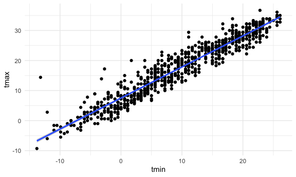

iteration_and_listcols
================
ruby
2025-10-28

``` r
library(tidyverse)
library(rvest)

knitr::opts_chunk$set(
  fig.width = 6,
  fig.asp = .6,
  out.width = "90%"
)

theme_set(theme_minimal() + theme(legend.position = "bottom"))

options(
  ggplot2.continuous.colour = "viridis",
  ggplot2.continuous.fill = "viridis"
)

scale_colour_discrete = scale_colour_viridis_d
scale_fill_discrete = scale_fill_viridis_d
```

## Make a list

``` r
l = 
  list(
    vec_numeric = 1:23,
    char_vec = c("Ruby"),
    mat = matrix(1:8, nrow = 2, ncol = 4),
    summary = summary(rnorm(1000, mean = 4))
  )

l
```

    ## $vec_numeric
    ##  [1]  1  2  3  4  5  6  7  8  9 10 11 12 13 14 15 16 17 18 19 20 21 22 23
    ## 
    ## $char_vec
    ## [1] "Ruby"
    ## 
    ## $mat
    ##      [,1] [,2] [,3] [,4]
    ## [1,]    1    3    5    7
    ## [2,]    2    4    6    8
    ## 
    ## $summary
    ##    Min. 1st Qu.  Median    Mean 3rd Qu.    Max. 
    ##  0.9489  3.2900  3.9957  4.0018  4.6980  7.3881

``` r
l[[1]]
```

    ##  [1]  1  2  3  4  5  6  7  8  9 10 11 12 13 14 15 16 17 18 19 20 21 22 23

## Make a different list

``` r
list_normals = 
  list(
    a = rnorm(30, mean = 3, sd = 1),
    b = rnorm(30, mean = 30, sd = 1),
    c = rnorm(30, mean = 3, sd = 10),
    d = rnorm(30, mean = 3, sd = 4)
  )

list_normals
```

    ## $a
    ##  [1] 1.702024 2.395322 3.334044 2.633289 2.467909 1.103166 3.135077 2.636229
    ##  [9] 2.445066 2.552926 1.974444 4.748937 3.837943 2.078795 3.995594 2.090778
    ## [17] 4.556262 1.427588 4.226829 4.808020 1.992388 1.782480 3.746053 3.621802
    ## [25] 3.857842 3.505210 3.379971 1.105593 2.263941 2.896881
    ## 
    ## $b
    ##  [1] 29.00825 29.02216 29.03178 29.05348 30.10630 30.40774 28.51548 30.58334
    ##  [9] 28.52754 29.61089 30.13254 29.48609 28.67714 28.33060 30.61379 29.66025
    ## [17] 30.32165 29.92253 30.21346 30.59903 30.58550 30.11038 29.71945 30.96456
    ## [25] 29.60794 29.14190 30.01391 29.06345 29.07567 30.24928
    ## 
    ## $c
    ##  [1] -18.28770718  23.52018844   2.12640556  27.60006302   0.49285973
    ##  [6]  -6.31274674  10.88924734   9.47409949 -10.31520187   3.50068244
    ## [11]   6.18271021   3.09541001  12.59273624  10.60429878   3.42815878
    ## [16]  -2.65493802  12.94125731   4.93177910 -13.75695931  -0.88265581
    ## [21]   0.03274812  -3.48463871  -4.29300890  -7.64766759   2.65148047
    ## [26]  10.74878245   6.41075740   9.47671388   7.26529088  -6.45389311
    ## 
    ## $d
    ##  [1]  5.5996743  1.9088449  5.8162439 -1.2651370  5.8088356  0.6119630
    ##  [7]  1.1572164 -3.0709756 -1.7260579 13.4490934  0.6512830  4.1748552
    ## [13] -0.1592522  6.0087232 -8.1428194  5.6119487 -1.7267410  1.9839455
    ## [19]  2.2704472  7.6081557 -2.5267989  5.2193447  1.7045147  1.0352635
    ## [25]  8.1156801  1.5932420 -2.0544677  3.9163259  5.5560322  2.2046849

(copy and paste function from last time)

``` r
mean_and_sd = function(x) {
  
  if(!is.numeric(x)) {
    stop("The input x should be numeric")
  }
  
  if(length(x) < 5) {
    stop("Only comupute mean and sd when the input has 5 or more numbers")
  }
  
  mean_x = mean(x, na.rm = TRUE)
  sd_x = sd(x, na.rm = TRUE)
  
  tibble(
    mean = mean_x, 
    sd = sd_x)
  
}
```

``` r
mean_and_sd(list_normals[[1]])
```

    ## # A tibble: 1 × 2
    ##    mean    sd
    ##   <dbl> <dbl>
    ## 1  2.88  1.05

Use a loop to iterate!

``` r
output = vector("list", length = 4)

for (i in 1:4) {
  output[[i]] = mean_and_sd(list_normals[[i]])
}

output
```

    ## [[1]]
    ## # A tibble: 1 × 2
    ##    mean    sd
    ##   <dbl> <dbl>
    ## 1  2.88  1.05
    ## 
    ## [[2]]
    ## # A tibble: 1 × 2
    ##    mean    sd
    ##   <dbl> <dbl>
    ## 1  29.7 0.733
    ## 
    ## [[3]]
    ## # A tibble: 1 × 2
    ##    mean    sd
    ##   <dbl> <dbl>
    ## 1  3.13  9.97
    ## 
    ## [[4]]
    ## # A tibble: 1 × 2
    ##    mean    sd
    ##   <dbl> <dbl>
    ## 1  2.38  4.20

Use `map` to do the same thing.

``` r
output = map(list_normals, mean_and_sd)


output = map(list_normals, median)
```

Check out some `map` variants

collapse maps into a dataframe

``` r
map_dfr(list_normals, mean_and_sd)
```

    ## # A tibble: 4 × 2
    ##    mean    sd
    ##   <dbl> <dbl>
    ## 1  2.88 1.05 
    ## 2 29.7  0.733
    ## 3  3.13 9.97 
    ## 4  2.38 4.20

can keep track of an input id

``` r
map_dfr(list_normals, mean_and_sd, .id = "sample")
```

    ## # A tibble: 4 × 3
    ##   sample  mean    sd
    ##   <chr>  <dbl> <dbl>
    ## 1 a       2.88 1.05 
    ## 2 b      29.7  0.733
    ## 3 c       3.13 9.97 
    ## 4 d       2.38 4.20

make result of single numbers into a dataframe of single numbers

``` r
map_dbl(list_normals, median)
```

    ##         a         b         c         d 
    ##  2.634759 29.689851  3.261784  1.946395

## LIST COLUMNS

try to put my list into a dataframe

``` r
listcol_df = 
  tibble(
    name = c("a", "b", "c", "d"),
    sample = list_normals
  )
```

did this really work - can check using`pull()`

``` r
pull(listcol_df, sample)
```

    ## $a
    ##  [1] 1.702024 2.395322 3.334044 2.633289 2.467909 1.103166 3.135077 2.636229
    ##  [9] 2.445066 2.552926 1.974444 4.748937 3.837943 2.078795 3.995594 2.090778
    ## [17] 4.556262 1.427588 4.226829 4.808020 1.992388 1.782480 3.746053 3.621802
    ## [25] 3.857842 3.505210 3.379971 1.105593 2.263941 2.896881
    ## 
    ## $b
    ##  [1] 29.00825 29.02216 29.03178 29.05348 30.10630 30.40774 28.51548 30.58334
    ##  [9] 28.52754 29.61089 30.13254 29.48609 28.67714 28.33060 30.61379 29.66025
    ## [17] 30.32165 29.92253 30.21346 30.59903 30.58550 30.11038 29.71945 30.96456
    ## [25] 29.60794 29.14190 30.01391 29.06345 29.07567 30.24928
    ## 
    ## $c
    ##  [1] -18.28770718  23.52018844   2.12640556  27.60006302   0.49285973
    ##  [6]  -6.31274674  10.88924734   9.47409949 -10.31520187   3.50068244
    ## [11]   6.18271021   3.09541001  12.59273624  10.60429878   3.42815878
    ## [16]  -2.65493802  12.94125731   4.93177910 -13.75695931  -0.88265581
    ## [21]   0.03274812  -3.48463871  -4.29300890  -7.64766759   2.65148047
    ## [26]  10.74878245   6.41075740   9.47671388   7.26529088  -6.45389311
    ## 
    ## $d
    ##  [1]  5.5996743  1.9088449  5.8162439 -1.2651370  5.8088356  0.6119630
    ##  [7]  1.1572164 -3.0709756 -1.7260579 13.4490934  0.6512830  4.1748552
    ## [13] -0.1592522  6.0087232 -8.1428194  5.6119487 -1.7267410  1.9839455
    ## [19]  2.2704472  7.6081557 -2.5267989  5.2193447  1.7045147  1.0352635
    ## [25]  8.1156801  1.5932420 -2.0544677  3.9163259  5.5560322  2.2046849

apply `mean_and_sd`

``` r
mean_and_sd(pull(listcol_df, sample)[[1]])
```

    ## # A tibble: 1 × 2
    ##    mean    sd
    ##   <dbl> <dbl>
    ## 1  2.88  1.05

iterate using `map`

``` r
map(pull(listcol_df, sample), mean_and_sd)
```

    ## $a
    ## # A tibble: 1 × 2
    ##    mean    sd
    ##   <dbl> <dbl>
    ## 1  2.88  1.05
    ## 
    ## $b
    ## # A tibble: 1 × 2
    ##    mean    sd
    ##   <dbl> <dbl>
    ## 1  29.7 0.733
    ## 
    ## $c
    ## # A tibble: 1 × 2
    ##    mean    sd
    ##   <dbl> <dbl>
    ## 1  3.13  9.97
    ## 
    ## $d
    ## # A tibble: 1 × 2
    ##    mean    sd
    ##   <dbl> <dbl>
    ## 1  2.38  4.20

adding a column for mean and sd

``` r
listcol_df=
  listcol_df |> 
  mutate(
    summary = map(sample, mean_and_sd)
  )

pull(listcol_df, summary)
```

    ## $a
    ## # A tibble: 1 × 2
    ##    mean    sd
    ##   <dbl> <dbl>
    ## 1  2.88  1.05
    ## 
    ## $b
    ## # A tibble: 1 × 2
    ##    mean    sd
    ##   <dbl> <dbl>
    ## 1  29.7 0.733
    ## 
    ## $c
    ## # A tibble: 1 × 2
    ##    mean    sd
    ##   <dbl> <dbl>
    ## 1  3.13  9.97
    ## 
    ## $d
    ## # A tibble: 1 × 2
    ##    mean    sd
    ##   <dbl> <dbl>
    ## 1  2.38  4.20

``` r
listcol_df |> 
  select(-sample) |> 
  unnest(summary)
```

    ## # A tibble: 4 × 3
    ##   name   mean    sd
    ##   <chr> <dbl> <dbl>
    ## 1 a      2.88 1.05 
    ## 2 b     29.7  0.733
    ## 3 c      3.13 9.97 
    ## 4 d      2.38 4.20

## revisiting nsduh

``` r
nsduh_url = 
  "http://samhda.s3-us-gov-west-1.amazonaws.com/s3fs-public/field-uploads/2k15StateFiles/NSDUHsaeShortTermCHG2015.htm"

nsduh_html = read_html(nsduh_url)

nsduh_import = function(html, table_num) {
  
  data = 
    html |> 
    html_table() |> 
    nth(table_num) |>
    slice(-1) |> 
    select(-contains("P Value")) |>
    pivot_longer(
      -State,
      names_to = "age_year", 
      values_to = "percent") |>
    separate(age_year, into = c("age", "year"), sep = "\\(") |>
    mutate(
      year = str_replace(year, "\\)", ""),
      percent = str_replace(percent, "[a-c]$", ""),
      percent = as.numeric(percent)) |>
    filter(!(State %in% c("Total U.S.", "Northeast", "Midwest", "South", "West")))
  
    data
}

nsduh_import(nsduh_html, table_num = 1)
```

    ## # A tibble: 510 × 4
    ##    State   age   year      percent
    ##    <chr>   <chr> <chr>       <dbl>
    ##  1 Alabama 12+   2013-2014    9.98
    ##  2 Alabama 12+   2014-2015    9.6 
    ##  3 Alabama 12-17 2013-2014    9.9 
    ##  4 Alabama 12-17 2014-2015    9.71
    ##  5 Alabama 18-25 2013-2014   27.0 
    ##  6 Alabama 18-25 2014-2015   26.1 
    ##  7 Alabama 26+   2013-2014    7.1 
    ##  8 Alabama 26+   2014-2015    6.81
    ##  9 Alabama 18+   2013-2014    9.99
    ## 10 Alabama 18+   2014-2015    9.59
    ## # ℹ 500 more rows

try this with a `for` loop

``` r
output = vector("list", length = 3)

for (i in 1:3) {
  
  output[[i]] = nsduh_import( html = nsduh_html, i)
  
}
```

do this with `map`

``` r
map(1:3, nsduh_import, html = nsduh_html)
```

    ## [[1]]
    ## # A tibble: 510 × 4
    ##    State   age   year      percent
    ##    <chr>   <chr> <chr>       <dbl>
    ##  1 Alabama 12+   2013-2014    9.98
    ##  2 Alabama 12+   2014-2015    9.6 
    ##  3 Alabama 12-17 2013-2014    9.9 
    ##  4 Alabama 12-17 2014-2015    9.71
    ##  5 Alabama 18-25 2013-2014   27.0 
    ##  6 Alabama 18-25 2014-2015   26.1 
    ##  7 Alabama 26+   2013-2014    7.1 
    ##  8 Alabama 26+   2014-2015    6.81
    ##  9 Alabama 18+   2013-2014    9.99
    ## 10 Alabama 18+   2014-2015    9.59
    ## # ℹ 500 more rows
    ## 
    ## [[2]]
    ## # A tibble: 510 × 4
    ##    State   age   year      percent
    ##    <chr>   <chr> <chr>       <dbl>
    ##  1 Alabama 12+   2013-2014    5.57
    ##  2 Alabama 12+   2014-2015    5.35
    ##  3 Alabama 12-17 2013-2014    4.98
    ##  4 Alabama 12-17 2014-2015    5.16
    ##  5 Alabama 18-25 2013-2014   15.0 
    ##  6 Alabama 18-25 2014-2015   14.3 
    ##  7 Alabama 26+   2013-2014    4.03
    ##  8 Alabama 26+   2014-2015    3.86
    ##  9 Alabama 18+   2013-2014    5.63
    ## 10 Alabama 18+   2014-2015    5.37
    ## # ℹ 500 more rows
    ## 
    ## [[3]]
    ## # A tibble: 510 × 4
    ##    State   age   year      percent
    ##    <chr>   <chr> <chr>       <dbl>
    ##  1 Alabama 12+   2013-2014    1.42
    ##  2 Alabama 12+   2014-2015    1.49
    ##  3 Alabama 12-17 2013-2014    4.46
    ##  4 Alabama 12-17 2014-2015    4.36
    ##  5 Alabama 18-25 2013-2014    6.04
    ##  6 Alabama 18-25 2014-2015    6.39
    ##  7 Alabama 26+   2013-2014    0.15
    ##  8 Alabama 26+   2014-2015    0.2 
    ##  9 Alabama 18+   2013-2014    0.95
    ## 10 Alabama 18+   2014-2015    1.05
    ## # ℹ 500 more rows

do this all in a dataframe - put the tibble for each table into this
dataframe that organizes it

``` r
nsduh_df = 
  tibble(
    name = c("marj year", "marj month", "marj first"),
    number = 1:3
  ) |> 
  mutate(
    table = map(number, nsduh_import, html = nsduh_html)
  ) |> 
  unnest(table)
```

## look at weather data

``` r
library(p8105.datasets)
data("weather_df")
```

``` r
weather_df |> 
  filter(name == "CentralPark_NY") |> 
  ggplot(aes(x = tmin, y = tmax)) +
  geom_point() +
  geom_smooth(method = "lm")
```

    ## `geom_smooth()` using formula = 'y ~ x'



let’s do a regression

``` r
weather_df |> 
  filter(name == "CentralPark_NY") |> 
  lm(tmax ~ tmin, data = _)
```

    ## 
    ## Call:
    ## lm(formula = tmax ~ tmin, data = filter(weather_df, name == "CentralPark_NY"))
    ## 
    ## Coefficients:
    ## (Intercept)         tmin  
    ##       7.514        1.034

``` r
weather_df |> 
  filter(name == "Molokai_HI") |> 
  lm(tmax ~ tmin, data = _)
```

    ## 
    ## Call:
    ## lm(formula = tmax ~ tmin, data = filter(weather_df, name == "Molokai_HI"))
    ## 
    ## Coefficients:
    ## (Intercept)         tmin  
    ##     21.7547       0.3222

``` r
weather_df |> 
  filter(name == "Waterhole_WA") |> 
  lm(tmax ~ tmin, data = _)
```

    ## 
    ## Call:
    ## lm(formula = tmax ~ tmin, data = filter(weather_df, name == "Waterhole_WA"))
    ## 
    ## Coefficients:
    ## (Intercept)         tmin  
    ##       7.532        1.137

let’s iterate differently… using `nest()`

``` r
weather_nest = 
  weather_df |> 
  nest(data = date:tmin)
```

``` r
lm(tmax ~ tmin, data = pull(weather_nest, data)[[1]])
```

    ## 
    ## Call:
    ## lm(formula = tmax ~ tmin, data = pull(weather_nest, data)[[1]])
    ## 
    ## Coefficients:
    ## (Intercept)         tmin  
    ##       7.514        1.034

``` r
lm(tmax ~ tmin, data = pull(weather_nest, data)[[2]])
```

    ## 
    ## Call:
    ## lm(formula = tmax ~ tmin, data = pull(weather_nest, data)[[2]])
    ## 
    ## Coefficients:
    ## (Intercept)         tmin  
    ##     21.7547       0.3222

``` r
lm(tmax ~ tmin, data = pull(weather_nest, data)[[3]])
```

    ## 
    ## Call:
    ## lm(formula = tmax ~ tmin, data = pull(weather_nest, data)[[3]])
    ## 
    ## Coefficients:
    ## (Intercept)         tmin  
    ##       7.532        1.137

do this using `map`

``` r
weather_lm = function(df) {
  
  lm(tmax ~ tmin, data = df)
  
}
```

``` r
map(pull(weather_nest, data), weather_lm)
```

    ## [[1]]
    ## 
    ## Call:
    ## lm(formula = tmax ~ tmin, data = df)
    ## 
    ## Coefficients:
    ## (Intercept)         tmin  
    ##       7.514        1.034  
    ## 
    ## 
    ## [[2]]
    ## 
    ## Call:
    ## lm(formula = tmax ~ tmin, data = df)
    ## 
    ## Coefficients:
    ## (Intercept)         tmin  
    ##     21.7547       0.3222  
    ## 
    ## 
    ## [[3]]
    ## 
    ## Call:
    ## lm(formula = tmax ~ tmin, data = df)
    ## 
    ## Coefficients:
    ## (Intercept)         tmin  
    ##       7.532        1.137

``` r
weather_nest = 
  weather_nest |> 
  mutate(
    lm_fits = map(data, weather_lm)
  )
```
