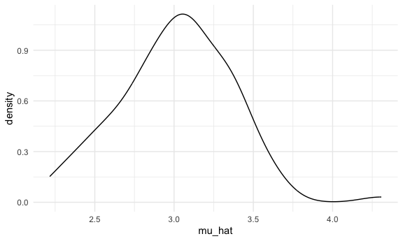
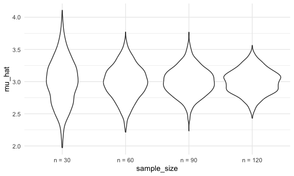
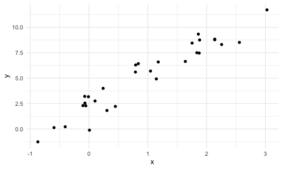
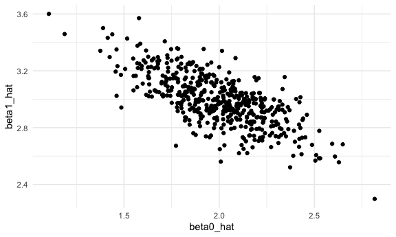
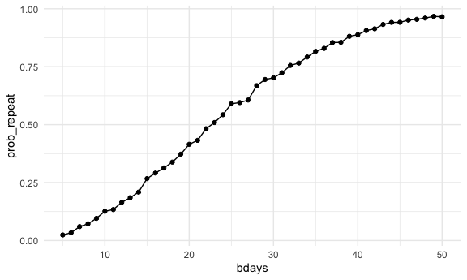

simulation
================
ruby
2025-10-30

load key packages, source files, settings

``` r
library(tidyverse)
library(rvest)
library(readxl)

source("sim_mean_sd.R")

knitr::opts_chunk$set(
  fig.width = 6,
  fig.asp = .6,
  out.width = "90%"
)

theme_set(theme_minimal() + theme(legend.position = "bottom"))

options(
  ggplot2.continuous.colour = "viridis",
  ggplot2.continuous.fill = "viridis"
)

scale_colour_discrete = scale_colour_viridis_d
scale_fill_discrete = scale_fill_viridis_d

set.seed(1)
```

we can “simulate” by running our function

``` r
sim_mean_sd(n_subj = 400)
```

    ## # A tibble: 1 × 2
    ##   mu_hat sigma_hat
    ##    <dbl>     <dbl>
    ## 1   3.08      1.94

can i “verify” the central limit theorem?

first with a `for` loop

``` r
output = vector("list", length = 100)

for (i in 1:100) {
  
  output[[i]] = sim_mean_sd(30)
}

output |> 
  bind_rows() |> 
  ggplot(aes(x = mu_hat)) +
  geom_density()
```



try to repeat with a map statement

``` r
sim_results_df = 
  expand_grid(
    sample_size = c(30, 60, 90, 120),
    iter = 1:1000
  ) |> 
  mutate(
    results = map(sample_size, sim_mean_sd)
  ) |> 
  unnest(results)
```

let’s look at this:

``` r
sim_results_df |> 
  mutate(
    sample_size = str_c("n = ", sample_size),
    sample_size = fct_inorder(sample_size)
  ) |> 
  ggplot(aes(x = sample_size, y = mu_hat)) +
  geom_violin()
```



let’s try to summarize …

``` r
sim_results_df |> 
  group_by(sample_size) |> 
  summarize(
    emp_mean = mean(mu_hat),
    emp_se = sd(mu_hat)
  )
```

    ## # A tibble: 4 × 3
    ##   sample_size emp_mean emp_se
    ##         <dbl>    <dbl>  <dbl>
    ## 1          30     3.00  0.357
    ## 2          60     2.99  0.257
    ## 3          90     3.00  0.216
    ## 4         120     3.00  0.190

## simple linear regression

``` r
sim_df = 
  tibble(
    x = rnorm(30, mean = 1, sd = 1),
    y = 2 + 3 * x + rnorm(30, 0, 1)
  ) 

sim_df |> 
  ggplot(aes(x = x, y = y)) +
  geom_point()
```



``` r
slr_fit = lm(y ~ x, data = sim_df)

coef(slr_fit)
```

    ## (Intercept)           x 
    ##    2.267718    3.076814

turn this into a function

``` r
sim_regression = function(n_subj, beta_0 = 2, beta_1 = 3) {
  
  sim_df = 
    tibble(
      x = rnorm(n_subj, mean = 1, sd = 1),
      y = beta_0 + beta_1 * x + rnorm(n_subj, 0, 1)
    ) 

  slr_fit = lm(y ~ x, data = sim_df)

  tibble(
    beta0_hat = coef(slr_fit)[1],
    beta1_hat = coef(slr_fit)[2]
    )

}
```

``` r
sim_regression(n_subj = 30)
```

    ## # A tibble: 1 × 2
    ##   beta0_hat beta1_hat
    ##       <dbl>     <dbl>
    ## 1      2.25      2.83

``` r
output = vector("list", length = 500)

for (i in 1:500) {
  
  output[[i]] = sim_regression(n_subj = 30)
}

output |> 
  bind_rows()
```

    ## # A tibble: 500 × 2
    ##    beta0_hat beta1_hat
    ##        <dbl>     <dbl>
    ##  1      1.90      3.05
    ##  2      2.13      2.87
    ##  3      1.97      2.95
    ##  4      1.77      3.45
    ##  5      2.11      2.98
    ##  6      1.82      3.01
    ##  7      1.89      2.91
    ##  8      1.60      3.10
    ##  9      1.84      2.96
    ## 10      1.56      3.23
    ## # ℹ 490 more rows

``` r
slr_sim_results_df = 
  expand_grid(
    sample_size = 30,
    iter = 1:500
  ) |> 
  mutate(
    results = map(sample_size, sim_regression)
  ) |> 
  unnest(results)


slr_sim_results_df |> 
  ggplot(aes(x = beta0_hat, y = beta1_hat)) +
  geom_point()
```



## one more example

``` r
birthdays = sample(1:365, 5, replace = TRUE)


repeated_bday = length(unique(birthdays)) < 5

repeated_bday
```

    ## [1] FALSE

put this into a function

``` r
bday_sim = function(n_room) {
  
  birthdays = sample(1:365, n_room, replace = TRUE)


repeated_bday = length(unique(birthdays)) < n_room

repeated_bday
  
}
```

test out the function

``` r
bday_sim(25)
```

    ## [1] FALSE

iterate

``` r
bday_sim_results = 
  expand_grid(
    bdays = 5:50,
    iter = 1:2500
  ) |> 
  mutate(
    result = map_lgl(bdays, bday_sim)
  ) |> 
  group_by(bdays) |> 
  summarize(
    prob_repeat = mean(result)
  )
```

plot this

``` r
bday_sim_results |> 
  ggplot(aes(x = bdays, y = prob_repeat)) +
  geom_point() +
  geom_line()
```


